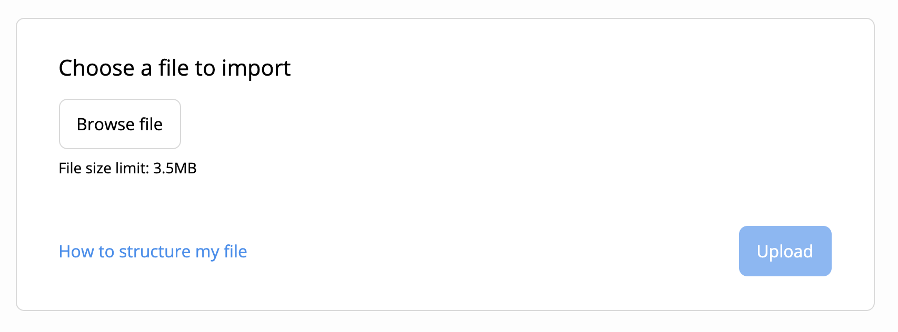

# CSV Importer Plugin for Linkurious Enterprise

## Description
The CSV importer is an official plugin maintained by the Linkurious team that allows you to import
external data from a CSV file into Linkurious Enterprise. It makes it possible to transform tabular
data into rich graph visualizations quickly.



### Prerequisites
- Linkurious Enterprise 2.9.x or above
- A connected Neo4j data-source in Linkurious 
- CSV files containing nodes or edges structured as follows:

#### For nodes


#### For edges


Two sample CSV files, for nodes and edges, are available [here](https://github.com/Linkurious/lke-plugin-csv-importer/tree/master/sample%20csv):
- `person.csv` contains information about person entities (a *node*);
- `ping.csv` contains information about relationships between two person nodes (a *relationship*).

## Set up the Plugin

> Make sure to have write access to the folder of Linkurious Enterprise as well as a Linkurious admin account.

1. Download the `lke-plugin-csv-importer-{version number}.lke` plugin available [here](https://github.com/Linkurious/lke-plugin-csv-importer/releases).
2. Copy `lke-plugin-csv-importer-{version number}.lke` file to the following path `<linkurious>/data/plugins`
3. From the Linkurious Enterprise dashboard, go to `Admin` -> `Global configuration`
4. Scroll to the `Plugin settings` field
5. On the `Plugin settings` section, modify the content as follows:

    ```json
    {
      "csv-importer": {
        "basePath": "importer"
      }
    }
    ```
7. Click on `Save`

## Access the plugin

To access the plugin it's recommended to create a custom action that will appear in right-click context menu within the Linkurious 
Enterprise UI.


In order to do so:

1. Open the *Custom action* panel (more information [here](https://doc.linkurio.us/user-manual/latest/custom-actions/#managing-custom-actions))
2. Click on `NEW CUSTOM ACTION`
3. Give a title within the `Custom action name` field
4. Fill the `URL template` field with the following URL: `{{baseurl}}plugins/importer/index.html?sourceKey={{sourcekey}}`
5. (Optional) Share the Custom Action with all users
6. Click on `SAVE`

> If you prefer to access the plugin directly via URL, you need to retrieve the sourceKey and replace it within the link:
> https://<your-linkurious-instance>/plugins/importer/index.html?sourceKey=<sourceKey>

## Use the plugin

1. Choose your CSV file and click the Upload button
2. Specify if you are uploading nodes or edges


3. Confirm the category name/edge type and the list of properties


4. For edges, specify the categories for the source and destination nodes
5. Click import
6. Check if data has been imported successfully


### Import status

After the import, you will get one of the following results:

1. **Successful**: All nodes / edges have been imported

2. **Failed**: Nothing has been imported

3. **Incomplete**: Some nodes/edges failed to be imported due to one of the following reasons:

   **a. Schema non-compliant data**:
      The schema type has phone as number, but in the csv the value of phone is a string. Same for date or booleans or other incompatible types

   **b. Unexpected properties (in strict schema)**:
      If the schema type has name and phone, but in your csv you have the headers name, phone, email, then it will fail for email

   **c. Missing required properties**:
      If the schema type has phone as required, but your csv has only name

   **d. Too many or missing header values**:
      Your header has 3 property names, but some rows have less than 3 or more than 3 comma-separated values

   **e. Source or target node does not exist**

   **f. Data-source is not available (including read-only)**

   **g. Unauthorized access to the data-source**

   **h. Error unknown**:
      Default message if error is not known

## Limitations

The maximum file size currently supported is 3.5MB.

## Licensing
The Linkurious CSV importer plugin is licensed under the Apache License, Version 2.0. See [LICENSE](/LICENSE) for the full license text.
